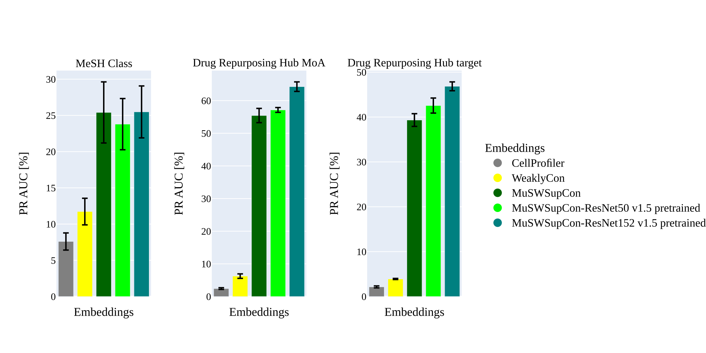

# Multi-label semi-weakly supervised contrastive learning for phenotypic screening

This repo contains the code to reproduce results from our paper [Multi-label semi-weakly supervised contrastive learning for phenotypic screening](xxx). In this work, we demonstrate the application of MuSWSemiSUpCon models for extracting meaningful features from Cell Painting image data, to facilitate acurate bioactivity prediction.

  

## Baseline comparisson

  

## Data