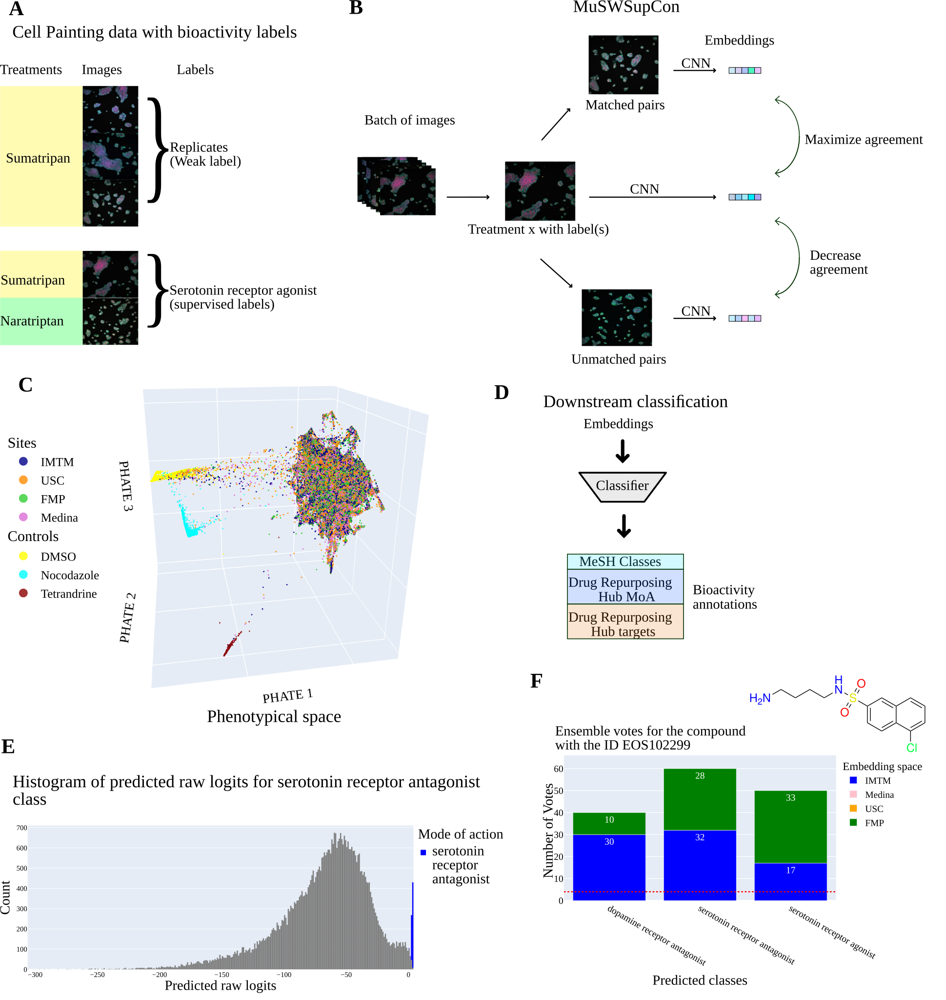
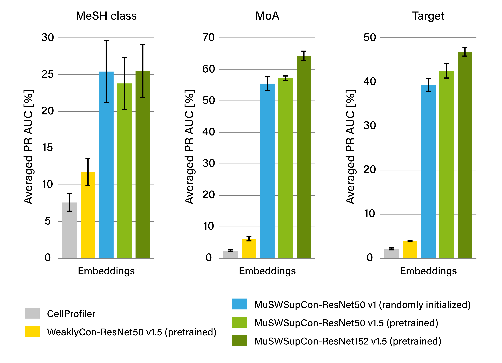

# Multi-label Bioactivity Prediction from Multi-site Cell Painting Data via Semi-Supervised Contrastive Learning and Ensemble Learning

This repo contains the code to reproduce results from our paper [Multi-label Bioactivity Prediction from Multi-site Cell Painting Data via Semi-Supervised Contrastive Learning and Ensemble Learning](xxx). In this work, we demonstrate the application of multi-label semi-weakly supervised contrastive learning (MuSWSupCon) models for extracting meaningful features from Cell Painting image data, to facilitate accurate bioactivity prediction. MuSWSupCon extends our previously published [SemiSupCon](https://pubs.acs.org/doi/10.1021/acs.jcim.4c00835) framework. The implementation of SemiSupCon is publicly available on GitHub at [https://github.com/AGSun-FMP/CP_SemiSupCon].

  

## Baseline comparisson on FMP Cell Painting dataset

  

## Data
### Images
[EU-OPENSCREEN Bioactive Cell Painting dataset](https://zenodo.org/records/14776021)

[EU-OPENSCREEN Bioactives HepG2 microscopy images processed with ImageJ](https://huggingface.co/datasets/davidbupw/euopen_cp_bioactives_ImgJ/)

[BBBC022 images processed with ImageJ](https://zenodo.org/records/10948460)

### Embeddings
[MuSWSupCon(EU-OS bioactives) Embeddings](https://huggingface.co/datasets/davidbupw/emb_EUOS_muswsupcon/)
